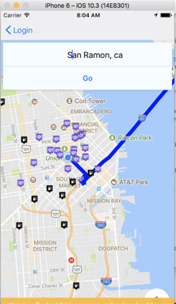
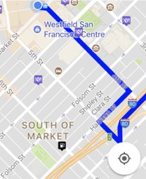
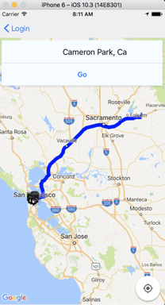

# Road Warriors

## The Problem
They say it's not about the destination. It's about the journey. Yet, can you really enjoy your journey when you always need to pull up Yelp, Google Maps, Safari, and a whole lot of other windows that add internal blockers to your seamless experience?

## The Solution
With the Road Warriors iOS app, you can reduce all those windows and apps to one. Get directions to your destination on the map, and as you travel, Road Warriors dynamically displays markers for gasoline stations and restaurants so you don't have to do that research.

## How It Works
We built this in our final week at Dev Bootcamp, and implemented a variety of technologies including the Yelp Fusion API, Google Developers APIs, RonR, React-Native, Xcode, and Heroku, and AirBnb's react-native-maps library.

When a user enters their destination, the app obtains the polylines from the Google Directions API, and displays the directions on AirBnb's react-native-maps. As the user travels, API calls are made to Yelp and Google Places to obtain results for restaurants and gasoline stations depending on the user's current location. These results are then parsed, and each place's coordinates display on the screen.

